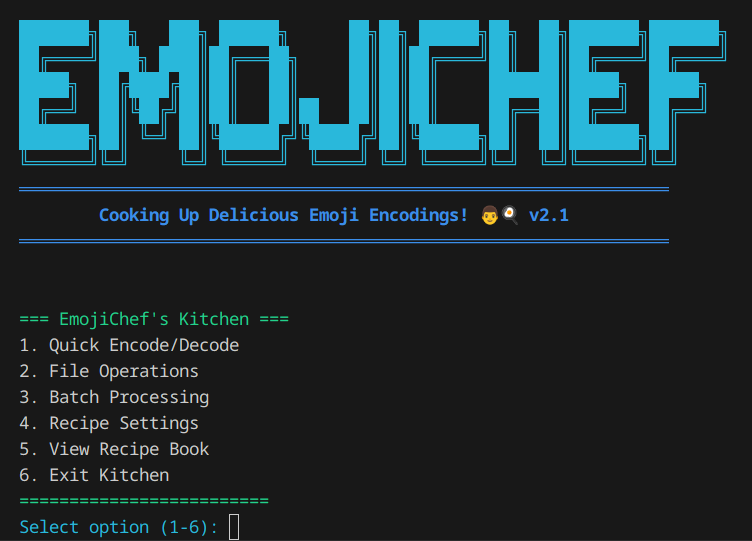

# 👨‍🍳 EmojiChef v2.2 | LoadedTater

Welcome to EmojiChef's Kitchen, where plain text gets cooked into delicious [emoji](https://home.unicode.org/emoji/) encodings! EmojiChef is a Python-based text encoder that transforms your messages into tasty emoji representations using various "recipe" types. Our kitchen serves up both classic and gourmet emoji dishes, with a focus on efficiency and flavor!

For peer review: [mathematic principles and encoding theory](docs/emojichef-v2-math.md) supporting EmojiChef v2.2

[Advanced User Guide](docs/emojichef-advanced-guide.md)

## Features

- 🔄 Multiple encoding bases (64, 128, 256, 1024)
- 📦 UTF-8 text and Binary file support
- 🗜️ Optional compression
- 📁 Batch processing
- 🛠️ Interactive menu for those who shall not be named

## Quick Start

1. Clone and run:
```bash
git clone https://github.com/FreddyRodgers/emojichef.git
cd emojichef
python emojichef-cli.py encode "Hello, World!"
```

2. Or use interactive mode:
```bash
python emojichef-cli.py interactive
```



That's it! You're cooking with emojis! 🎉

## Quick Examples

### Encode Some Text
```bash
# Basic encoding
python emojichef-cli.py encode "Hello!"
>> 😀😃😄😁😆😅

# With compression
python emojichef-cli.py encode -c zlib "Hello!"
>> 😎😋😉😊

# Different recipe (base-64 with food emojis)
python emojichef-cli.py encode -r quick "Hello!"
>> 🍅🍆🍇🍈🍉🍊
```

### Process Files
```bash
# Encode a file
python emojichef-cli.py encode -f message.txt -o encoded.emoji

# Decode a file
python emojichef-cli.py decode -f encoded.emoji -o decoded.txt

# Process multiple files
python emojichef-cli.py batch "*.txt" --batch-output encoded_files/
```

## More Examples

### Handling Different File Types
```bash
# Text files
python emojichef-cli.py encode -f document.txt -o document.emoji

# Log files with compression
python emojichef-cli.py encode -f app.log -c zlib -o compressed.emoji

# Configuration files with verification
python emojichef-cli.py encode -f config.json -v sha256 -o config.emoji
```

### Batch Processing Examples
```bash
# Process all text files
python emojichef-cli.py batch "*.txt" 

# Process specific file types
python emojichef-cli.py batch "docs/*.md" --batch-output encoded/

# Process with compression
python emojichef-cli.py batch "logs/*.log" -c zlib
```

### File Analysis
```bash
# Get optimal settings for a file
python emojichef-cli.py analyze -f large_file.txt

# Check encoded file
python emojichef-cli.py analyze -f encoded.emoji
```

### Command Line Options
```bash
# Show all options
python emojichef-cli.py --help

# Show version
python emojichef-cli.py --version

# Quiet mode (no progress output)
python emojichef-cli.py encode -f file.txt -q
```

## Common Tasks

### Text Messages
```bash
# Standard message
python emojichef-cli.py encode "Meeting at 3pm"

# URL encoding
python emojichef-cli.py encode -r gourmet "https://example.com"

# Multi-line text
python emojichef-cli.py encode "Line 1
Line 2
Line 3"
```

### File Operations
```bash
# Encode with best compression
python emojichef-cli.py encode -f data.txt -r gourmet -c zlib

# Process with verification
python emojichef-cli.py encode -f important.txt -v sha256

# Quick processing
python emojichef-cli.py encode -f notes.txt -r quick
```

## Recipe Types

- 🍅 **Quick** (Base-64): Food emojis, best for small messages
- 🎰 **Light** (Base-128): Activity emojis, balanced encoding
- 😀 **Classic** (Base-256): Smiley emojis, standard encoding
- 🤠 **Gourmet** (Base-1024): Extended emojis, maximum efficiency

###
[Emoji Mapping Documentation](docs/emoji-mappings.md)

## Requirements

- Python 3.6 or later
- No additional dependencies!

## Security Note

⚠️ EmojiChef is an encoding tool, not an encryption tool. [Do not use it for sensitive data](docs/emojichef-security-notice.md).

## Acknowledgments

- Inspired by [Wingdings](https://en.wikipedia.org/wiki/Wingdings), [CyberChef](https://github.com/gchq/CyberChef), and the prior experimental emoji encoding schemes 
   - emojicoding (Base1024): [https://github.com/shea256/emojicoding](https://github.com/shea256/emojicoding)
   - Ecoji 2.0 (Base1024): [https://github.com/keith-turner/ecoji](https://github.com/keith-turner/ecoji)
- Motivated by [Mr. Jeff the Man](https://x.com/MrJeffMan), [shmoocon](https://shmoocon.org) lobbycon, and [nyxgeek](https://x.com/nyxgeek) 
- Special thanks to the emoji standards committee and Claude 3.5 Sonnet

## Version History

- v2.2: CLI rewrite with option for interactive menu
- v2.1: Added binary file support and enhanced menu
- v2.0: Flawed Rewrite: Added compression and file operations
- [v1.0](https://github.com/FreddyRodgers/emojichef-v1): Initial release with basic encoding

## License

This project is licensed under the MIT License - see the [LICENSE](LICENSE.MD) file for details.